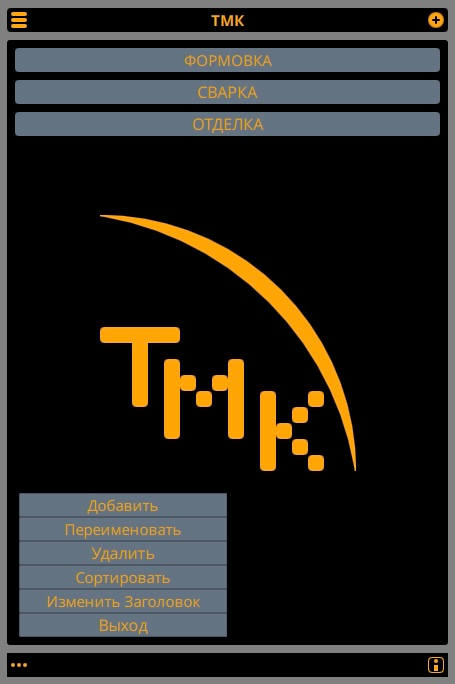
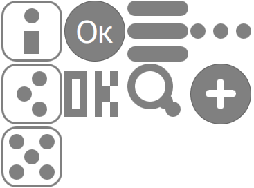

# Mentor 

The project provides an editor for document directories and their viewer.

The main goal is to create a catalog of documents necessary for working here and now.
Program structure: Menu->List->Items->Data->File Explorer.

github:
https://github.com/DruidCat/qt-working-diagrams

## Terms of use and participation

The source code of the project is provided under [license](LICENSE.GPLv3.md),
which requires disclosure of the source code.

[Member's Agreement](CONTRIBUTING.md) regulates the rights granted by DruidCat members.

Information about participants is provided in the file [AUTHORS](AUTHORS.md).

[Code of Conduct](CODE_OF_CONDUCT.md) is a valid set of DruidCat rules that informs you about the
expectations for interaction between community members when communicating and working on projects.

## Project Structure

The project has a standard application structure based on C++ and QML.

* File **[ru.WorkingDiagrams.pro](ru.WorkingDiagrams.pro)**
        describes the project structure for the qmake build system.
* File **[CMakeLists.txt](CMakeLists.txt)**
        describes the project structure for the cmake build system.
* Catalog **[icons](icons)** contains app icons for supported screen resolutions.
* Catalog **[qml](qml)** directory contains the QML source code and user interface resources.
	* Catalog **[DCButtons](qml/DCButtons)** directory contains the app's buttons.
	* Catalog **[DCMethods](qml/DCMethods)** directory contains the app's methods.
	* Catalog **[DCPages](qml/DCPages)** contains application pages (Menu, List, Items, Data, Explorer).
	* Catalog **[DCZones](qml/DCZones)** contains the main page zones (List, Items, Data, Explorer).
    * File **[ru.WorkingDiagrams.qml](qml/ru.WorkingDiagrams.qml)**
                provides an implementation of the application window.
* Catalog **[js](js)** contains java script files.
	* File **[jsJSON.js](js/jsJSON.js)**
                functions written in java script.
* Catalog **[src](src)** directory contains the C++source code.
    * File **[main.cpp](src/main.cpp)** is the entry point to the app.
* Catalog **[translations](translations)** contains user interface translation files.
* File **[ru.WorkingDiagrams.desktop](ru.WorkingDiagrams.desktop)**
        defines the display and launch parameters of the app.

## Compatibility

The project is compatible with:

* Windows 7, 8, 10, 11.
* GNU/Linux.
* MacOS.
* Android.
* iOS.

## How the app works

- [DCDB](src/dcdb.h) a class that works with an SQL database.
- [DCDBData](src/dcdbdata.h) a class that works with files written to an SQL database.
- [DCCppQml](src/cppqml.h) a class that is a driver that allows C++ and QML code to work with each other.
- [Stranica](qml/DCPages/Stranica.qml) main template for the program interface.

## Screenshots

	snapshot of the Mentor app.

	a snapshot of the buttons located in (qml/DCBottons).

## This document in Russia 

- [README.ru.md](README.ru.md)
