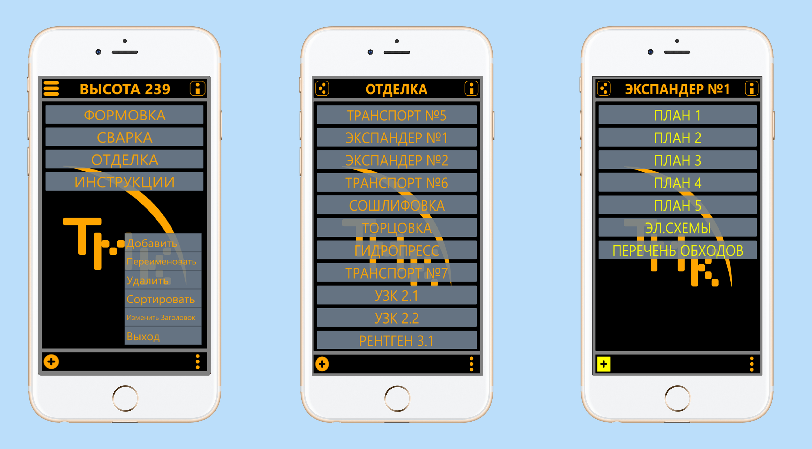

# Ментор (Mentor)

Проект предоставляет собой редактор каталогов документов и их просмоторщик.

Главная цель - это создание каталога докумментов необходимого для работы здесь и сейчас.
Структура программы: Меню->Список->Элементы->Данные->Проводник.

github:
https://github.com/DruidCat/qt-working-diagrams

## Условия использования и участия

Исходный код проекта предоставляется по [лицензии](LICENSE.GPLv3.md), которая обязывает раскрытие исходного 
кода.

[Соглашение участника](CONTRIBUTING.md) регламентирует права, предоставляемые участниками компании «DruidCat».

Информация об участниках указана в файле [AUTHORS](AUTHORS.md).

[Кодекс поведения](CODE_OF_CONDUCT.md) — это действующий набор правил компании «DruidCat», который информирует
об ожиданиях по взаимодействию между членами сообщества при общении и работе над проектами.

## Структура проекта

Проект имеет стандартную структуру приложения на базе C++ и QML.

* Файл **[ru.WorkingDiagrams.pro](ru.WorkingDiagrams.pro)**
        описывает структуру проекта для системы сборки qmake.
* Файл **[CMakeLists.txt](CMakeLists.txt)**
        описывает структуру проекта для системы сборки cmake.
* Каталог **[icons](icons)** содержит иконки приложения для поддерживаемых разрешений экрана.
* Каталог **[qml](qml)** содержит исходный код на QML и ресурсы интерфейса пользователя.
	* Каталог **[DCButtons](qml/DCButtons)** содержит кнопки приложения.
	* Каталог **[DCMethods](qml/DCMethods)** содержит методы приложения.
	* Каталог **[DCPages](qml/DCPages)** содержит страницы приложения (Меню, Список, Элементы, Данные, Проводник).
	* Каталог **[DCZones](qml/DCZones)** содержит основные зоны страниц (Список, Элементы, Данные, Проводник).
	* Файл **[ru.WorkingDiagrams.qml](qml/ru.WorkingDiagrams.qml)**
                предоставляет реализацию окна приложения.
* Каталог **[js](js)** содержит java script файлы.
	* Файл **[jsJSON.js](js/jsJSON.js)**
				функции написанные на java script.
* Каталог **[src](src)** содержит исходный код на C++.
    * Файл **[main.cpp](src/main.cpp)** является точкой входа в приложение.
* Каталог **[translations](translations)** содержит файлы перевода интерфейса пользователя.
* Файл **[ru.WorkingDiagrams.desktop](ru.WorkingDiagrams.desktop)**
        определяет отображение и параметры запуска приложения.
        
## Совместимость

Проект совместим:

* Windows 7, 8, 10, 11.
* GNU/Linux.
* MacOS.
* Android.
* iOS.

## Работа приложения

- [DCDB](src/dcdb.h) класс работающий с SQL базой данных.
- [DCDBData](src/dcdbdata.h) класс работающий с файлами записанными в SQL базу данных.
- [DCCppQml](src/cppqml.h) класс являющийся драйвером, обеспечивающим работу С++ и QML кода друг с другом.
- [Stranica](qml/DCPages/Stranica.qml) основной шаблон интерфейса программы.

## Снимки экранов

    снимок приложения Рабочие Схемы.

    снимок кнопок находящихся в (qml/bottons).

## This document in English

- [README.md](README.md)
